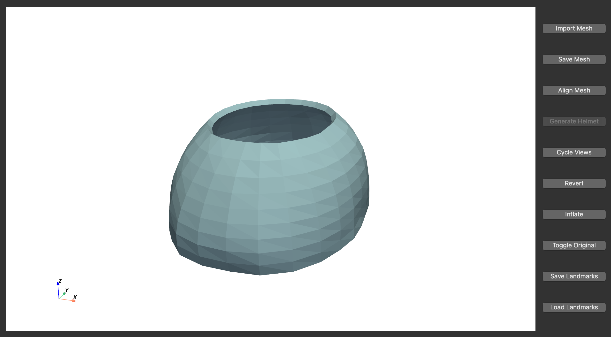

# Helmetpy

A helmet generation program using surface head scans for unicoronal craniosynostosis.
It generates the top part of the helmet.

## Features

- GUI with [pyside6](https://doc.qt.io/qtforpython-6/index.html).
- Mesh registration with manual landmarking.
- Helmet base model generation using [trimesh](https://trimesh.org/index.html).
- Model repair using [pymeshfix](https://pymeshfix.pyvista.org/index.html).
- Model touch ups with 'inflate'.

## Notes

- Manual landmarking requires three locations:
  1. Temporal right - located directly above the superior helix point of the right ear.
  2. Glabella - smooth area of the forehead located between the eyebrows, just above the nose.
  3. Temporal left - similar to “Temporal right” but on the left side of the head.

- See [run.sh](./run.sh) for example usage.

## Screenshots

